```
╔═══════════════════════════════════════════════════════════════════════════════╗
║                                                                               ║
║  ██╗    ██╗██╗███╗   ██╗██████╗  ██████╗ ██╗    ██╗███████╗                  ║
║  ██║    ██║██║████╗  ██║██╔══██╗██╔═══██╗██║    ██║██╔════╝                  ║
║  ██║ █╗ ██║██║██╔██╗ ██║██║  ██║██║   ██║██║ █╗ ██║███████╗                  ║
║  ██║███╗██║██║██║╚██╗██║██║  ██║██║   ██║██║███╗██║╚════██║                  ║
║  ╚███╔███╔╝██║██║ ╚████║██████╔╝╚██████╔╝╚███╔███╔╝███████║                  ║
║   ╚══╝╚══╝ ╚═╝╚═╝  ╚═══╝╚═════╝  ╚═════╝  ╚══╝╚══╝ ╚══════╝                  ║
║                                                                               ║
║        ███╗   ███╗ █████╗ ███████╗████████╗███████╗██████╗ ██╗   ██╗         ║
║        ████╗ ████║██╔══██╗██╔════╝╚══██╔══╝██╔════╝██╔══██╗╚██╗ ██╔╝         ║
║        ██╔████╔██║███████║███████╗   ██║   █████╗  ██████╔╝ ╚████╔╝          ║
║        ██║╚██╔╝██║██╔══██║╚════██║   ██║   ██╔══╝  ██╔══██╗  ╚██╔╝           ║
║        ██║ ╚═╝ ██║██║  ██║███████║   ██║   ███████╗██║  ██║   ██║            ║
║        ╚═╝     ╚═╝╚═╝  ╚═╝╚══════╝   ╚═╝   ╚══════╝╚═╝  ╚═╝   ╚═╝            ║
║                                                                               ║
║          The Ultimate A–Z Windows Knowledge Base for Power Users              ║
╚═══════════════════════════════════════════════════════════════════════════════╝
```

<div align="center">

[](https://github.com/vibhor-777/Windows-Mastery/stargazers)
[](https://github.com/vibhor-777/Windows-Mastery/network/members)
[](LICENSE)
[](https://github.com/vibhor-777/Windows-Mastery/graphs/contributors)
[](https://github.com/vibhor-777/Windows-Mastery/commits/main)
[](https://github.com/vibhor-777/Windows-Mastery/issues)

**The most comprehensive, structured Windows knowledge base covering shortcuts, CMD, PowerShell, registry, System32, security, and advanced tweaks — built for developers, power users, and sysadmins.**

[🚀 Quick Start](#-quick-start) • [📁 Browse Content](#-repository-structure) • [💡 Key Concepts](#-key-concepts) • [🤝 Contribute](#-contributing)

</div>

---

## 📋 Table of Contents

| Section | Description |
|---------|-------------|
| [🎯 Overview](#-overview) | What Windows Mastery is and why it matters |
| [✨ Features](#-features) | Key capabilities and content highlights |
| [🏗️ Architecture](#️-architecture) | Windows knowledge map |
| [📁 Repository Structure](#-repository-structure) | Visual directory tree |
| [🚀 Quick Start](#-quick-start) | Get up and running in minutes |
| [💡 Key Concepts](#-key-concepts) | Core Windows power-user concepts |
| [🤝 Contributing](#-contributing) | How to contribute |
| [📜 License](#-license) | License information |

---

## 🎯 Overview

> **Windows Mastery** is an open-source, research-grade knowledge base dedicated to unlocking the full potential of the Windows operating system through structured documentation, practical examples, and deep technical insights.

This repository contains:

- ⌨️ **Keyboard Shortcuts** — Comprehensive A–Z shortcut references for Windows, Explorer, and productivity apps
- 🖥️ **CMD Mastery** — Command Prompt encyclopaedia with real-world usage, flags, and examples
- ⚡ **PowerShell Expertise** — Scripting guides, automation recipes, and one-liners for sysadmins
- 🗂️ **Registry Deep Dive** — Safe registry tweaks, hive structures, and backup strategies
- 🔧 **System32 Reference** — Documented System32 binaries, their purposes, and safe usage
- 🌐 **Environment Variables** — Complete variable reference with customization walkthroughs
- 🛡️ **Security & Hardening** — Group Policy, firewall rules, UAC, and hardening checklists
- 🚀 **Advanced Tweaks** — Performance tuning, startup optimization, and power-user tricks

> 💡 **Goal**: Give every Windows user — from beginner to expert — a single trusted reference that is accurate, actionable, and always up to date.

---

## ✨ Features

| Feature | Description |
|---------|-------------|
| ⌨️ **A–Z Shortcuts** | Every keyboard shortcut organized by category and context |
| 🖥️ **CMD Encyclopedia** | 200+ commands with syntax, flags, and copy-paste examples |
| ⚡ **PowerShell Scripts** | Ready-to-run automation scripts and function libraries |
| 🗂️ **Registry Guide** | Hive-by-hive breakdown with safe-tweak recipes |
| 🔧 **System32 Map** | Purpose and safe-usage notes for every major binary |
| 🌐 **Env Variables** | Full variable list with scope rules and custom-path recipes |
| 🛡️ **Security Hardening** | Step-by-step checklists for home, dev, and enterprise setups |
| 🚀 **Performance Tweaks** | Boot time, RAM, and disk optimizations with benchmarks |
| 📋 **Structured Docs** | Consistent format: overview → syntax → examples → notes |
| 🔍 **Searchable Index** | Master index for instant lookup across all topics |

---

## 🏗️ Architecture

### Windows Knowledge Map

```mermaid
flowchart TD
    A[🪟 Windows Mastery] --> B[⌨️ Shortcuts]
    A --> C[🖥️ CMD]
    A --> D[⚡ PowerShell]
    A --> E[🗂️ Registry]
    A --> F[🔧 System32]
    A --> G[🌐 Env Variables]
    A --> H[🛡️ Security]
    A --> I[🚀 Advanced Tweaks]

    B --> B1[System Shortcuts]
    B --> B2[Explorer Shortcuts]
    B --> B3[App Shortcuts]

    C --> C1[File & Dir Commands]
    C --> C2[Network Commands]
    C --> C3[System Info Commands]

    D --> D1[Scripting Basics]
    D --> D2[Automation Recipes]
    D --> D3[Module Reference]

    H --> H1[Group Policy]
    H --> H2[Firewall Rules]
    H --> H3[UAC & Permissions]

    style A fill:#0078D4,color:#fff
    style B fill:#FFD700,color:#000
    style C fill:#4ECDC4,color:#000
    style D fill:#A8E6CF,color:#000
    style E fill:#DDA0DD,color:#000
    style F fill:#FFA07A,color:#000
    style G fill:#FF6B6B,color:#fff
    style H fill:#FF6B6B,color:#fff
    style I fill:#4ECDC4,color:#000
```



### Windows Power-User Stack

```
┌─────────────────────────────────────────────────────────────┐
│                    WINDOWS MASTERY STACK                     │
├─────────────────────────────────────────────────────────────┤
│  🚀  Advanced Tweaks      → Performance & Power-User Tricks  │
│  🛡️  Security Hardening   → Policies, Firewall, UAC         │
│  🌐  Environment Vars     → PATH, USERPROFILE, Custom Vars   │
│  🔧  System32             → Core Binaries & Safe Usage       │
│  🗂️  Registry             → HKLM, HKCU, Hive Deep-Dives     │
│  ⚡  PowerShell           → Scripting, Automation, Modules   │
│  🖥️  CMD                  → Commands, Flags, Pipelines       │
│  ⌨️  Shortcuts            → Keyboard → Speed → Productivity  │
└─────────────────────────────────────────────────────────────┘
```

---

## 📁 Repository Structure

```
Windows-Mastery/
├── 📄 README.md                          # This file
├── 📄 LICENSE                            # MIT License
├── 📄 CONTRIBUTING.md                    # Contribution guidelines
│
├── ⌨️ shortcuts/
│   ├── README.md                         # Shortcuts overview
│   ├── system-shortcuts.md               # Win key combos & system shortcuts
│   ├── explorer-shortcuts.md             # File Explorer navigation
│   ├── browser-shortcuts.md              # Edge / Chrome / Firefox
│   ├── accessibility-shortcuts.md        # Ease of access shortcuts
│   └── app-shortcuts.md                  # Office, VS Code, Terminal
│
├── 🖥️ cmd/
│   ├── README.md                         # CMD overview & tips
│   ├── file-directory.md                 # dir, cd, mkdir, del, xcopy …
│   ├── network.md                        # ping, tracert, netstat, ipconfig …
│   ├── system-info.md                    # systeminfo, tasklist, wmic …
│   ├── user-management.md                # net user, net localgroup …
│   ├── scripting.md                      # Batch scripting basics & recipes
│   └── advanced.md                       # Pipes, redirection, for loops
│
├── ⚡ powershell/
│   ├── README.md                         # PowerShell overview
│   ├── basics.md                         # Cmdlets, aliases, help system
│   ├── scripting.md                      # Scripts, functions, modules
│   ├── automation.md                     # Scheduled tasks, WinRM, remoting
│   ├── system-management.md              # Services, processes, events
│   ├── network.md                        # DNS, firewall, adapter config
│   └── one-liners.md                     # Copy-paste power one-liners
│
├── 🗂️ registry/
│   ├── README.md                         # Registry overview & safety guide
│   ├── hive-structure.md                 # HKLM, HKCU, HKCR, HKU, HKCC
│   ├── safe-tweaks.md                    # Curated safe registry tweaks
│   ├── startup.md                        # Run, RunOnce, startup keys
│   ├── ui-customization.md               # Desktop, Explorer, taskbar tweaks
│   └── backup-restore.md                 # Export/import & restore points
│
├── 🔧 system32/
│   ├── README.md                         # System32 overview
│   ├── core-binaries.md                  # cmd.exe, explorer.exe, svchost …
│   ├── network-tools.md                  # netsh, ipconfig, nslookup …
│   ├── security-tools.md                 # icacls, cipher, certutil …
│   ├── diagnostic-tools.md               # msconfig, eventvwr, perfmon …
│   └── scripting-hosts.md                # wscript, cscript, mshta …
│
├── 🌐 environment-variables/
│   ├── README.md                         # Env variable overview
│   ├── system-variables.md               # WINDIR, SystemRoot, TEMP …
│   ├── user-variables.md                 # USERPROFILE, APPDATA, HOMEPATH …
│   ├── path-management.md                # Adding, editing, troubleshooting PATH
│   └── custom-variables.md               # Creating & using custom variables
│
├── 🛡️ security/
│   ├── README.md                         # Security hardening overview
│   ├── group-policy.md                   # GPO settings & local policy
│   ├── firewall.md                       # Windows Defender Firewall rules
│   ├── uac-permissions.md                # UAC levels, NTFS permissions
│   ├── bitlocker.md                      # Drive encryption setup & management
│   ├── defender.md                       # Windows Defender configuration
│   └── hardening-checklist.md            # Step-by-step hardening checklist
│
└── 🚀 advanced-tweaks/
    ├── README.md                         # Advanced tweaks overview
    ├── performance.md                    # CPU, RAM, disk optimizations
    ├── startup-optimization.md           # Boot time reduction strategies
    ├── visual-customization.md           # UI tweaks, themes, transparency
    ├── power-plans.md                    # Power plan tuning & custom plans
    └── wsl-integration.md                # WSL2 setup & Windows integration
```

---

## 🚀 Quick Start

### Clone the Repository

```bash
git clone https://github.com/vibhor-777/Windows-Mastery.git
cd Windows-Mastery
```

### Browse by Topic

```bash
# Explore CMD commands
cat cmd/network.md

# Find PowerShell one-liners
cat powershell/one-liners.md

# Check security hardening steps
cat security/hardening-checklist.md
```

### Find What You Need Fast

| I want to… | Go to… |
|------------|--------|
| Learn a keyboard shortcut | [`shortcuts/`](shortcuts/) |
| Run a CMD command | [`cmd/`](cmd/) |
| Write a PowerShell script | [`powershell/`](powershell/) |
| Safely tweak the registry | [`registry/safe-tweaks.md`](registry/safe-tweaks.md) |
| Understand a System32 binary | [`system32/core-binaries.md`](system32/core-binaries.md) |
| Manage environment variables | [`environment-variables/`](environment-variables/) |
| Harden my Windows install | [`security/hardening-checklist.md`](security/hardening-checklist.md) |
| Speed up my PC | [`advanced-tweaks/performance.md`](advanced-tweaks/performance.md) |

---

## 💡 Key Concepts

<details>
<summary><b>🖥️ CMD vs PowerShell — When to Use Which</b></summary>

### CMD (Command Prompt)
Best for:
- Simple file operations and legacy batch scripts
- Quick network diagnostics (`ping`, `tracert`, `ipconfig`)
- Running classic Windows utilities (`sfc`, `chkdsk`)
- Scripts that need to run on systems without PowerShell

### PowerShell
Best for:
- Object-oriented scripting and automation
- System administration and remote management (WinRM)
- Working with .NET objects, COM, and WMI
- Modern DevOps pipelines and CI/CD tasks

```powershell
# PowerShell: Get all running services as objects
Get-Service | Where-Object { $_.Status -eq 'Running' } | Select-Object Name, DisplayName

# CMD equivalent (plain text, harder to process)
sc query type= all state= active
```

</details>

<details>
<summary><b>🗂️ Registry Safety Rules</b></summary>

Always follow these rules before editing the registry:

1. **Back up first** — `reg export HKLM\Software backup.reg`
2. **Create a restore point** — System Properties → System Protection → Create
3. **Edit only known keys** — Never delete keys you did not create
4. **Use `.reg` files** — Safer than manual edits; diff-able and reversible
5. **Test on a VM** — Validate tweaks in a virtual machine before applying to production

```cmd
:: Export a registry hive before editing
reg export "HKEY_CURRENT_USER\Software\MyApp" "C:\Backup\MyApp.reg"

:: Import it back if something breaks
reg import "C:\Backup\MyApp.reg"
```

</details>

<details>
<summary><b>🛡️ Windows Security Hardening — Quick Wins</b></summary>

Apply these immediately on any Windows machine:

```powershell
# 1. Enable Windows Defender real-time protection
Set-MpPreference -DisableRealtimeMonitoring $false

# 2. Enable firewall on all profiles
Set-NetFirewallProfile -Profile Domain,Public,Private -Enabled True

# 3. Disable SMBv1 (legacy, vulnerable)
Set-SmbServerConfiguration -EnableSMB1Protocol $false -Force

# 4. Check for pending Windows updates
Get-WindowsUpdate

# 5. Audit local admin accounts
Get-LocalGroupMember -Group "Administrators"
```

</details>

---

## 🤝 Contributing

We welcome contributions from developers, sysadmins, and Windows enthusiasts!

**Ways to contribute:**
- 📝 Add new commands, scripts, or shortcuts
- 🔧 Improve existing documentation with better examples
- 🐛 Fix errors or outdated information
- 🛡️ Add new security hardening techniques
- 🚀 Share advanced tweaks and optimizations

Please read [CONTRIBUTING.md](CONTRIBUTING.md) for detailed guidelines.

```bash
# Standard contribution workflow
git checkout -b feature/add-powershell-recipes
git commit -m "feat: add PowerShell automation recipes for disk management"
git push origin feature/add-powershell-recipes
# Open a Pull Request on GitHub
```

---

## 📈 Star History

[](https://star-history.com/#vibhor-777/Windows-Mastery&Date)

---

## 📜 License

This project is licensed under the **MIT License** — see [LICENSE](LICENSE) for details.

> All content is provided for educational and informational purposes. Always test registry and system tweaks in a safe environment before applying them to production machines.

---

<div align="center">

**Made with ❤️ for the Windows power-user community**

[⬆ Back to Top](#)

</div>
